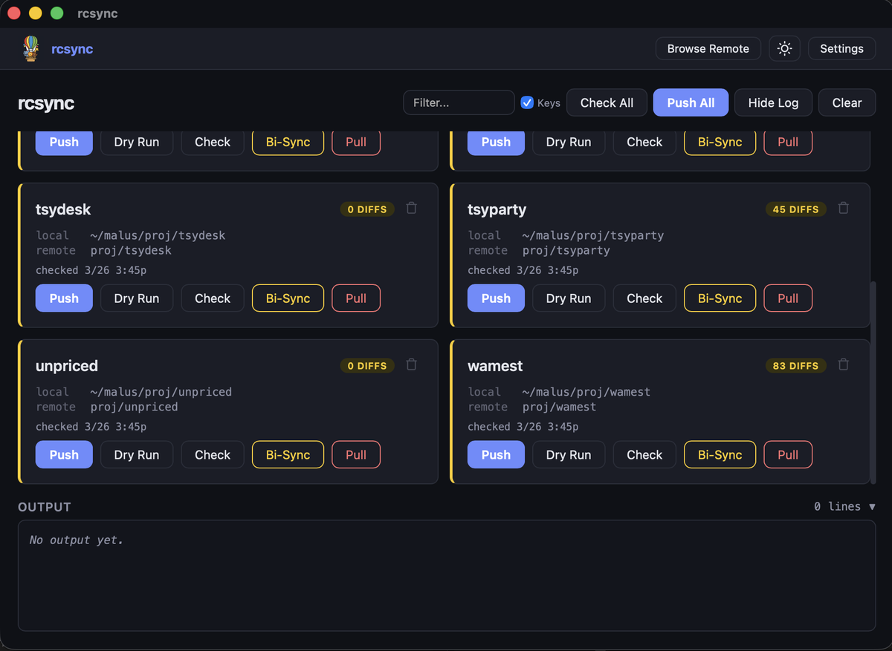

<p align="center">
  
</p>

<h1 align="center">rcsync</h1>

<p align="center">
  A lightweight, keyboard-driven desktop app for syncing local project folders with cloud storage via <a href="https://rclone.org">rclone</a>.
</p>

<p align="center">
  Built with <a href="https://tauri.app">Tauri v2</a> + <a href="https://svelte.dev">Svelte 5</a>. Cross-platform (macOS, Windows, Linux).
</p>

<p align="center">
  
</p>

---

## What it does

- **Push** local projects to Google Drive, OneDrive, or any rclone remote
- **Check** which files differ between local and remote
- **Pull** or **Bi-Sync** when needed (with safety confirmations)
- **Auto-discover** local projects by scanning directories
- **Multi-remote** support — switch between cloud drives with pill tabs
- **Keyboard-driven** — vim-style navigation, single-key actions
- **Portable config** — syncs between devices via Syncthing or similar

### Design philosophy

**Local is always authoritative.** Push is the default. Pull and Bi-Sync require explicit confirmation with Cancel focused by default. Delete only removes the local copy — the remote is never touched.

## Prerequisites

### 1. Install rclone

```bash
# macOS (Homebrew)
brew install rclone

# Windows (Scoop)
scoop install rclone

# Or download from https://rclone.org/downloads/
```

### 2. Configure your remote(s)

rcsync doesn't handle authentication — rclone does. Set up your remotes first:

```bash
# Interactive setup — follow the prompts
rclone config

# Example: set up Google Drive
# Choose "Google Drive", follow OAuth flow, name it "gdrive"

# Example: set up OneDrive
# Choose "Microsoft OneDrive", follow OAuth flow, name it "onedrive"
```

After setup, verify your remotes work:

```bash
# List configured remotes
rclone listremotes

# Test access
rclone lsd gdrive:
rclone lsd onedrive:
```

### 3. Organize your projects

rcsync expects projects to be folders under a base path on the remote. For example:

```
gdrive:proj/
  ├── my-webapp/
  ├── data-pipeline/
  └── ml-experiment/
```

Push a project for the first time:

```bash
rclone sync ~/projects/my-webapp gdrive:proj/my-webapp
```

After that, rcsync handles all subsequent syncs through the UI.

## Install

### From source

```bash
git clone https://github.com/smkwray/rcsync.git
cd rcsync
npm install
npx tauri build
```

The built app is at `src-tauri/target/release/bundle/`.

### Development

```bash
npx tauri dev
```

## Configuration

rcsync stores its config as `rcsync-config.json` next to the app binary (portable). Example:

```json
{
  "rclone_path": "rclone",
  "remote": "gdrive",
  "remotes": [
    { "name": "gdrive", "base_path": "proj" },
    { "name": "onedrive", "base_path": "Projects" }
  ],
  "excludes": [
    "node_modules/**", ".git/**", ".venv/**",
    "__pycache__/**", "target/**", "dist/**",
    ".DS_Store", "._*"
  ],
  "scan_dirs": ["~/projects", "~/code"],
  "projects": [],
  "auto_check_on_launch": false
}
```

### Key settings

| Setting | Description |
|---|---|
| `remote` | Active remote name |
| `remotes` | Available remotes with their base paths |
| `scan_dirs` | Local directories to scan for project folders |
| `excludes` | Glob patterns to skip during sync |
| `auto_check_on_launch` | Run Check All when the app opens |

### Adding a new remote

1. Configure it in rclone: `rclone config`
2. Add it to `remotes` in rcsync settings (or edit the config file)
3. Switch to it in Browse Remote using the pill tabs

## Keyboard shortcuts

Toggle with the **Keys** checkbox or **Cmd+K**.

| Key | Action | Always on? |
|---|---|---|
| `j` / `k` | Navigate down / up | |
| `l` / `;` | Navigate left / right | |
| `a` | Push selected | |
| `s` | Dry Run | |
| `d` | Check | |
| `f` | Bi-Sync | |
| `g` | Pull | |
| `h` | Delete local | |
| `/` | Focus filter | |
| `c` | Check All | |
| `p` | Push All | |
| `o` | Toggle output | |
| `b` | Browse Remote | |
| `?` | Shortcut help | Yes |
| `Cmd+,` | Settings | Yes |
| `Cmd+K` | Toggle shortcuts | Yes |
| `Cmd+O` | Toggle output | Yes |
| `Esc` | Close / deselect | Yes |

## How it works

- **Push** = `rclone sync local remote` — one-way upload, local wins
- **Pull** = `rclone sync remote local` — one-way download, remote wins
- **Bi-Sync** = `rclone bisync local remote` — two-way merge
- **Check** = `rclone check --combined` — compare without changing anything
- **Dry Run** = `rclone sync --dry-run` — preview what Push would do

All operations respect the configured exclude patterns.

## License

MIT
