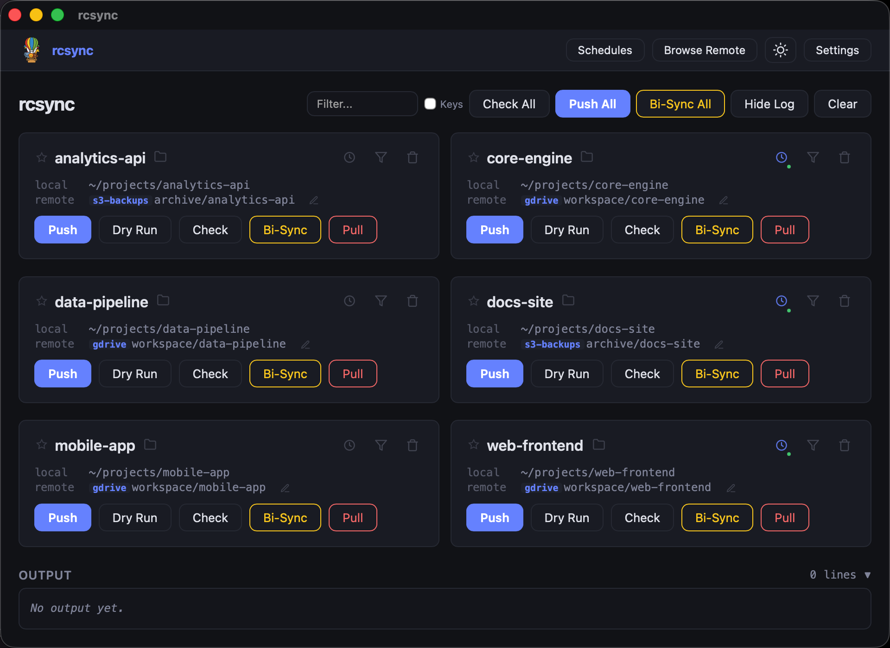

<p align="center">
  
</p>

<h1 align="center">rcsync</h1>

<p align="center">
  A lightweight, keyboard-driven desktop app for syncing local project folders with cloud storage via <a href="https://rclone.org">rclone</a>.
</p>

<p align="center">
  Built with <a href="https://tauri.app">Tauri v2</a> + <a href="https://svelte.dev">Svelte 5</a>. Configured to target macOS, Windows, and Linux.
</p>

<p align="center">
  
</p>

---

## What it does

- **Push** local projects to Google Drive, OneDrive, or any rclone remote
- **Check** which files differ between local and remote
- **Pull** or **Bi-Sync** when needed (with safety confirmations)
- **Auto-discover** local projects by scanning directories
- **File watching** — detects local changes and marks projects as "modified"
- **Multi-remote** support — switch between cloud drives with pill tabs
- **Keyboard-driven** — vim-style navigation, single-key actions
- **Pin projects** to the top of the dashboard (persists across sessions)
- **Scheduled Push** — push a project on an interval or selected weekdays while rcsync is open
- **Shared project config** — project definitions can sync between devices via Syncthing or similar; automation stays device-local
- **Retired-target protection** — an explicit local deletion is recorded against its exact remote target, so a stale leftover discovered on another device cannot be pushed back without reattaching it

### Design philosophy

**Local is always authoritative.** Push is the default and runs unconfirmed. Pull, Bi-Sync and Delete each require you to type a confirmation word — `pull`, `bisync`, `delete` — with Cancel focused by default. Delete only removes the local copy; the remote is never touched.

Defaults are merged into your filter set and cannot be removed from configuration, so they are kept deliberately narrow: caches, virtualenvs, build output, VCS metadata and OS junk. Anything specific to how *you* organise a project belongs in `extra_excludes`, not here.

## Prerequisites

Building from source requires Node.js 18 or newer with npm, Rust with the
stable toolchain, and the platform prerequisites listed in the
[Tauri prerequisites guide](https://v2.tauri.app/start/prerequisites/). The
release configuration targets macOS, Windows, and Linux; local release
validation is recorded separately for each platform.

### 1. Install rclone

```bash
# macOS (Homebrew)
brew install rclone

# Windows (Scoop)
scoop install rclone

# Or download from https://rclone.org/downloads/
```

### 2. Configure your remote(s)

rcsync doesn't handle authentication — rclone does. Set up your remotes first:

```bash
# Interactive setup — follow the prompts
rclone config

# Example: set up Google Drive
# Choose "Google Drive", follow OAuth flow, name it "gdrive"

# Example: set up OneDrive
# Choose "Microsoft OneDrive", follow OAuth flow, name it "onedrive"
```

After setup, verify your remotes work:

```bash
# List configured remotes
rclone listremotes

# Test access
rclone lsd gdrive:
rclone lsd onedrive:
```

### 3. Organize your projects

rcsync expects projects to be folders under a base path on the remote. For example:

```
gdrive:proj/
  ├── my-webapp/
  ├── data-pipeline/
  └── ml-experiment/
```

Push a project for the first time:

```bash
rclone sync ~/projects/my-webapp gdrive:proj/my-webapp
```

After that, rcsync handles all subsequent syncs through the UI.

## Install

### From source

```bash
git clone https://github.com/smkwray/rcsync.git
cd rcsync
npm ci
npm run tauri build
```

The built app is at `src-tauri/target/release/bundle/`.

### Development

```bash
npm run tauri dev
```

## Configuration

rcsync uses a shared project config and a device-local automation config:

### `defaults.json` (public, ships with the app)

Contains exclude patterns and default scan directories. Safe to check into version control and share across devices.

```json
{
  "excludes": [
    "node_modules/**", ".git/**", ".worktrees/**",
    ".venv*/**", ".tmp-validate-venv/**", "src-tauri/target/**",
    "__pycache__/**", ".pytest_cache/**", ".mypy_cache/**", ".ruff_cache/**",
    ".DS_Store", "._*", "Thumbs.db", "desktop.ini"
  ],
  "scan_dirs": ["~/projects"],
  "default_pull_dir": "~/projects"
}
```

### `rcsync-config.json` (private, portable)

User-specific shared settings — remotes, projects, paths, and excludes. Stored
next to the app binary (portable) so project definitions can sync between
devices via Syncthing. Each project has a stable `id`; keep it when renaming a
project so its device-local automation remains attached to the same project.

```json
{
  "rclone_path": "rclone",
  "remote": "gdrive",
  "remotes": [
    { "name": "gdrive", "base_path": "proj" },
    { "name": "onedrive", "base_path": "Projects" }
  ],
  "extra_excludes": ["dist/**", "*.log"],
  "scan_dirs": ["~/projects", "~/code"],
  "projects": [],
  "auto_check_on_launch": false
}
```

Default excludes are always applied. `extra_excludes` adds your own patterns on top — both are shown in Settings, but defaults can't be removed from the UI.

### Device-local automation config

Schedules and the scheduled-Push queue policy are stored only on the device
running rcsync, under the platform local application-data directory, in a file
named `local-config-<device-id>.json`. On macOS this is normally under
`~/Library/Application Support/rcsync`; on Windows it is normally under
`%LOCALAPPDATA%\rcsync`. The stable device ID is kept separately in that same
local-data directory and is not based solely on the hostname.

This separation is intentional: syncing `rcsync-config.json` to a laptop does
not turn on the same automatic Push there. If the same schedule is deliberately
configured in both local automation files, both devices can still Push; rcsync
does not provide a distributed cross-device lock.

When rcsync deletes a local project, it also records the exact resolved remote
target in the shared config as retired. A leftover directory discovered on
another device remains visible for inspection, but Push, Bi-Sync, and Resync
are blocked for that target until you explicitly reattach it. This protection
matches the remote name and resolved remote path, not the local or project name,
so an unrelated project with the same name is not blocked. Reattaching creates
a new project identity and does not restore an old schedule or start a Push.

A schedule runs only while rcsync is open. If the app is reopened after a due
time, one stale Push is queued for each affected project; repeated missed
occurrences coalesce into that one Push. The Schedule Manager defaults new
schedules to 24 hours and provides 12-, 24-, and 48-hour one-click presets.
With **Queue scheduled pushes** enabled, scheduled Pushes run one at a time and
due projects wait their turn. Push remains local-authoritative and can remove
remote-only files.

Older configs may contain `schedule` inside a project or
`queue_scheduled_pushes` at the top level. Those shared legacy values are
disabled on load. Use **Schedules → Move here** once, on the device that should
own them, to copy them into the local automation config and remove them from
the shared file. Migration is explicit so opening the same synced config on a
second device cannot silently enable its schedules.

Older releases could also create a whole config named for the machine. Those
files are not selected automatically. If one is found, open Settings and use
**Convert here** to copy it into the canonical `rcsync-config.json`; schedules
still require the separate **Move here** action.

```json
{
  "id": "p_8f5e7b7d2e3a91c4",
  "name": "my-webapp",
  "local_path": "~/projects/my-webapp",
  "remote_path": "proj/my-webapp"
}
```

Use the clock icon on a project card, or press `t` with a project selected, to
edit its schedule. The scheduler uses the same Push path, filters, empty-source
guard, cancellation, and progress reporting as a manual Push.

### Key settings

| Setting | File | Description |
|---|---|---|
| `excludes` | defaults.json | Base exclude patterns (shared) |
| `extra_excludes` | rcsync-config.json | Additional user excludes (merged with defaults) |
| `remote` | rcsync-config.json | Active remote name |
| `remotes` | rcsync-config.json | Available remotes with their base paths |
| `scan_dirs` | rcsync-config.json | Local directories to scan for project folders |
| `auto_check_on_launch` | rcsync-config.json | Run Check All when the app opens |
| `queue_scheduled_pushes` | device-local automation config | Queue scheduled Pushes so only one scheduled project runs at a time; enabled by default on each device |
| `rclone_transfers` | rcsync-config.json | Files transferred in parallel per rclone process. Omit for Automatic (rclone's own setting); 1–8 otherwise |

### Supported rclone configuration

rcsync refuses to push a project whose source rclone considers empty, because
`rclone sync` makes the destination match the source — an empty source would delete
the remote copy. That guard works by asking rclone itself, with the same exclude
arguments the push will use. Two boundaries follow from how it works:

- **Don't modify a project while it is being pushed.** The check and the sync are two
  rclone invocations. A source emptied between them can still be synced as empty.
- **Remote-level `global.*` overrides in your rclone config are not supported.** The
  guard inspects a local path, so a remote that rewrites sync or filter behaviour when
  it is instantiated would affect the push without affecting the check.

Ordinary rclone remotes — including anything configured through `rclone config` in the
normal way — are unaffected by either.

### Adding a new remote

1. Configure it in rclone: `rclone config`
2. Add it to `remotes` in rcsync settings (or edit the config file)
3. Switch to it in Browse Remote using the pill tabs

## Keyboard shortcuts

Toggle with the **Keys** checkbox or **Cmd+K**.

| Key | Action | Always on? |
|---|---|---|
| `j` / `k` | Navigate down / up | |
| `l` / `;` | Navigate left / right | |
| `a` | Push selected | |
| `s` | Dry Run | |
| `d` | Check | |
| `f` | Bi-Sync | |
| `g` | Pull | |
| `h` | Delete local | |
| `t` | Schedule Push | |
| `/` | Focus filter | |
| `c` | Check All | |
| `p` | Push All | |
| `o` | Toggle output | |
| `b` | Browse Remote | |
| `?` | Shortcut help | Yes |
| `Cmd+,` | Settings | Yes |
| `Cmd+K` | Toggle shortcuts | Yes |
| `Cmd+O` | Toggle output | Yes |
| `Esc` | Close / deselect | Yes |

## How it works

- **Push** = `rclone sync local remote` — one-way upload, local wins
- **Pull** = `rclone sync remote local` — one-way download, remote wins
- **Bi-Sync** = `rclone bisync local remote` — two-way merge
- **Check** = `rclone check --combined` — compare without changing anything
- **Dry Run** = `rclone sync --dry-run` — preview what Push would do

All operations respect the configured exclude patterns.

## License

MIT
